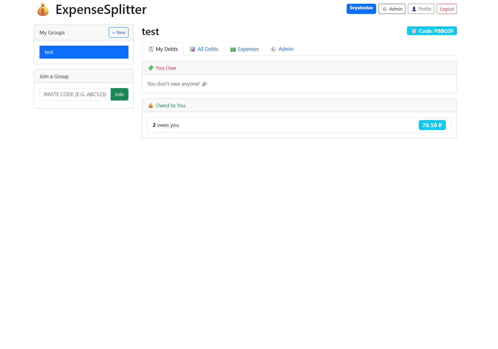
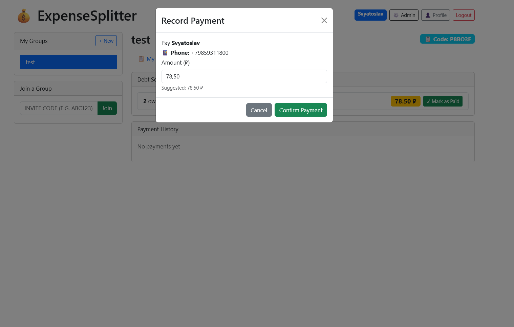

# ExpenseSplitter

A web app that automatically calculates who owes whom after shared expenses among friends, roommates, or travel groups.

## Demo





## Product Context

### End Users
University students, roommates, and friend groups who share living expenses, groceries, utilities, or travel costs.

### Problem
Tracking shared expenses and settling debts manually is tedious and error-prone. Friends often avoid discussing money to prevent awkward conversations, leading to unresolved debts and damaged relationships.

### Solution
ExpenseSplitter lets users create expense groups, log who paid for what, and instantly see a clear breakdown of who owes whom — eliminating manual calculations and awkward money conversations.

## Features

### Implemented (Version 1)
- ✅ User registration and login
- ✅ Create expense groups with unique invite codes
- ✅ Join groups by invite code
- ✅ Add expenses with custom splits
- ✅ Automatic debt calculation algorithm
- ✅ Personal profiles with payment details
- ✅ "Mark as Paid" with payment history
- ✅ Personalized "My Debts" tab
- ✅ Admin panel for user/group management
- ✅ Docker Compose deployment

### Planned (Future)
- 🔄 LLM-powered expense entry (natural language parsing)
- 🔄 Export reports (PDF/CSV)
- 🔄 Expense history filtering
- 🔄 Mobile app

## Usage

1. **Register** an account and fill in your payment details (phone, card)
2. **Create** a new group (e.g., "Apartment 42") and share the invite code
3. **Join** existing groups by entering their invite code
4. **Add expenses**: enter description, amount, select who paid
5. **Check "My Debts"** tab to see who you owe and who owes you
6. **Mark as Paid** when debts are settled

## Deployment

### Requirements
- **OS:** Ubuntu 24.04 (or any Linux with Docker support)
- **Installed:** Docker and Docker Compose

### Step-by-Step Instructions

1. **Clone the repository:**
   ```bash
   git clone https://github.com/YOUR_USERNAME/se-toolkit-hackathon.git
   cd se-toolkit-hackathon
   ```

2. **Start all services:**
   ```bash
   docker-compose up -d
   ```

3. **Access the application:**
   - Frontend: http://YOUR_VM_IP
   - Backend API: http://YOUR_VM_IP/api
   - API Docs: http://YOUR_VM_IP/api/docs

4. **Stop the application:**
   ```bash
   docker-compose down
   ```

### Architecture
- **Frontend:** React + Bootstrap (served via Nginx)
- **Backend:** Python + FastAPI
- **Database:** PostgreSQL 16
